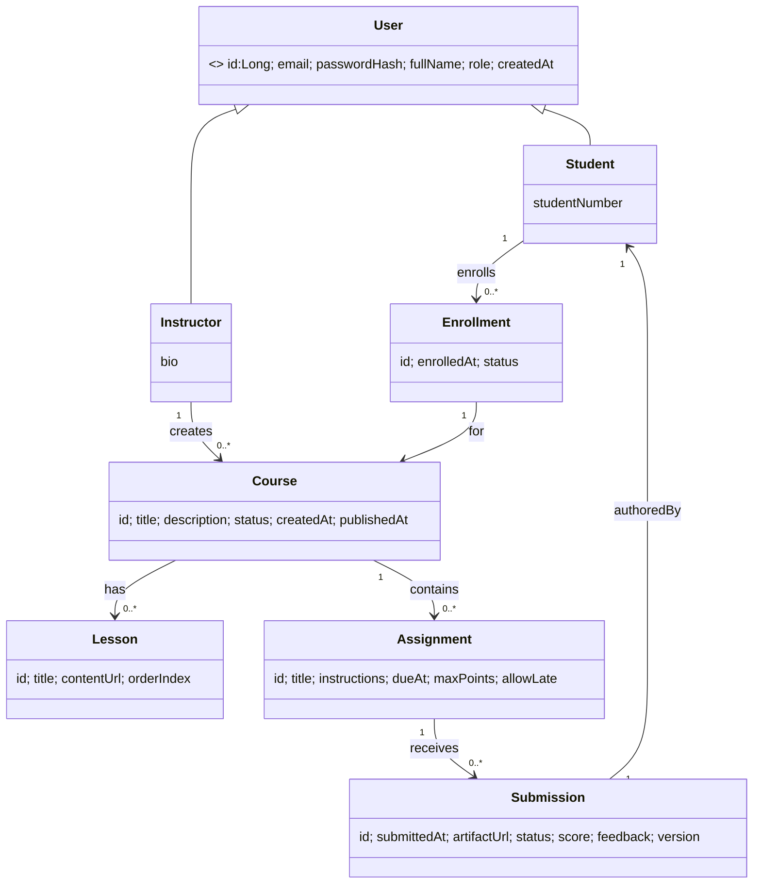
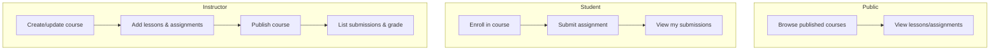

# IronLMS

A lightweight Learning Management System (LMS) backend built with **Java 17** and **Spring Boot 3.x**.  
It demonstrates clean RESTful design, JPA inheritance, JWT authentication, robust error handling, and solid test coverage (≥ 80%).

---

## ✨ Features

- Users & roles with inheritance: **User** (abstract), **Student**, **Instructor**
- Course lifecycle (**DRAFT → PUBLISHED**), lessons & assignments
- Enrollment (student self-enroll), submissions & instructor grading
- JWT Bearer auth + role-based authorization
- JSON **ProblemDetail** errors (400/401/403/404/409)
- Flyway migrations & MySQL 8 storage
- Swagger/OpenAPI documentation
- Unit + Integration tests with **JaCoCo** coverage ≥ 80%

---

## 🧭 Architecture

### Class Diagram (simplified)
> Full PlantUML: `docs/uml/ironlms-class.puml` (render to PNG as `docs/uml/ironlms-class.png` and embed below)


<details>
<summary>Mermaid quick view</summary>


</details>

### Use-Case Diagram (overview)


## ⚙️ Setup
### Prerequisites

- Java 17
- Maven (or use the Maven Wrapper ./mvnw)
- MySQL 8
- (Optional) DBeaver, Postman/Insomnia

### Configuration

Create/adjust src/main/resources/application.properties

### Run locally

```
# With Maven
mvn spring-boot:run

# Or with Maven Wrapper (no global Maven needed)
./mvnw spring-boot:run
```

App runs at http://localhost:3315

### Swagger/OpenAPI
- UI: http://localhost:3315/swagger-ui.html
- JSON: http://localhost:3315/v3/api-docs

### Demo accounts (seeded for dev)
- Instructor: instructor@lms.local / password
- Student: student@lms.local / password

## 🔐 Authorization Matrix

| Endpoint                                 | Public | Student | Instructor | Admin |
| ---------------------------------------- | :----: | :-----: | :--------: | :---: |
| `GET /api/courses/**` (published only)   |    ✅   |    ✅    |      ✅     |   ✅   |
| `GET /api/courses/{id}/lessons`          |   ✅\*  |    ✅    |      ✅     |   ✅   |
| `GET /api/courses/{id}/assignments`      |   ✅\*  |    ✅    |      ✅     |   ✅   |
| `POST/PUT/PATCH/DELETE /api/courses/**`  |    ❌   |    ❌    |      ✅     |   ✅   |
| `POST /api/courses/{id}/enroll`          |    ❌   |    ✅    |      ❌     |   ❌   |
| `POST /api/assignments/{id}/submissions` |    ❌   |    ✅    |      ❌     |   ❌   |
| `PATCH /api/submissions/{id}/grade`      |    ❌   |    ❌    |      ✅     |   ✅   |

* Draft courses are visible only to their instructor (or admin).

## 📡 Controllers & Routes (selected)

Auth

POST /auth/login → { token }

GET /api/me → current user profile

Courses

GET /api/courses?page=&size= → page of PUBLISHED courses

GET /api/courses/{id} → detail (draft visible to owner/admin)

POST /api/courses (instructor/admin)

PUT /api/courses/{id} (instructor/admin)

DELETE /api/courses/{id} (instructor/admin)

Lessons

GET /api/courses/{id}/lessons (public for published)

POST /api/courses/{id}/lessons (instructor/admin)

PUT /api/courses/{id}/lessons/{lessonId} (instructor/admin)

DELETE /api/courses/{id}/lessons/{lessonId} (instructor/admin)

Assignments

GET /api/courses/{id}/assignments (public for published)

POST /api/courses/{id}/assignments (instructor/admin)

PUT /api/courses/{id}/assignments/{assignmentId} (instructor/admin)

DELETE /api/courses/{id}/assignments/{assignmentId} (instructor/admin)

Enrollment

POST /api/courses/{id}/enroll (student) (duplicate → 409)

GET /api/enrollments (mine)

Submissions

POST /api/assignments/{id}/submissions (student)

GET /api/submissions/mine (student)

PATCH /api/submissions/{id}/grade (instructor/admin)

🧪 Testing & Coverage

Profiles: tests run with test profile (H2 in-memory, Flyway off).

Integration: MockMvc for auth, authorization, enrollments, submissions.

Unit: Mockito tests for services (happy + error paths).

Coverage: ≥ 80% with JaCoCo.

From IntelliJ (Run with Coverage using JaCoCo), or:

mvn test jacoco:report
# Open:
# target/site/jacoco/index.html


On Windows, if IntelliJ’s built-in coverage runner fails on non-ASCII paths, switch the coverage runner to JaCoCo (Run Configuration → Code Coverage).

🪵 Error Handling

All errors use ProblemDetail:

{
  "type": "about:validation-error",
  "title": "Validation failed",
  "status": 400,
  "errors": [
    { "field": "title", "message": "must not be blank" }
  ]
}


401/403 for auth/authz

404 for not found

409 for uniqueness conflicts (e.g., duplicate enrollment)

🚀 Quickstart (curl)
# Login (instructor)
curl -s -X POST http://localhost:3315/auth/login \
  -H "Content-Type: application/json" \
  -d '{"email":"instructor@lms.local","password":"password"}'

# Public courses
curl -s "http://localhost:3315/api/courses?page=0&size=10"

# Login (student) and enroll
STUD=$(curl -s -X POST http://localhost:3315/auth/login \
  -H "Content-Type: application/json" \
  -d '{"email":"student@lms.local","password":"password"}' | jq -r .token)

curl -i -X POST http://localhost:3315/api/courses/1/enroll \
  -H "Authorization: Bearer $STUD"

🗂 Project Management

Board: (add your Trello/Jira link)

Workflow: feature-branch with multiple commits per day and clear messages.

🧰 Technologies

Java 17, Spring Boot 3.x

Spring Web, Spring Data JPA (Hibernate), Spring Security (JWT)

MySQL 8, Flyway

Jakarta Bean Validation (Hibernate Validator)

Springdoc OpenAPI

JUnit 5, Mockito, JaCoCo

Lombok

🔭 Future Work

File uploads for rich submissions (S3/GCS)

Instructor dashboards & analytics

Soft delete + audit trail (Hibernate Envers)

Rate limiting & API keys for public endpoints

Caching for course catalog

👥 Team / Credits

Your Name(s) Here

Built for IronHack (Module 2 Final Project)

📝 License

This project is licensed under the MIT License. See LICENSE for details.

🔗 Extra Links

Repository: (add your GitHub URL)

Slides: (add link)

Postman collection: docs/postman/IronLMS.postman_collection.json

::contentReference[oaicite:0]{index=0}


